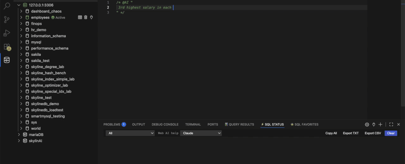
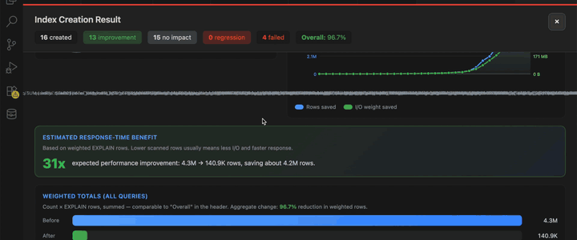
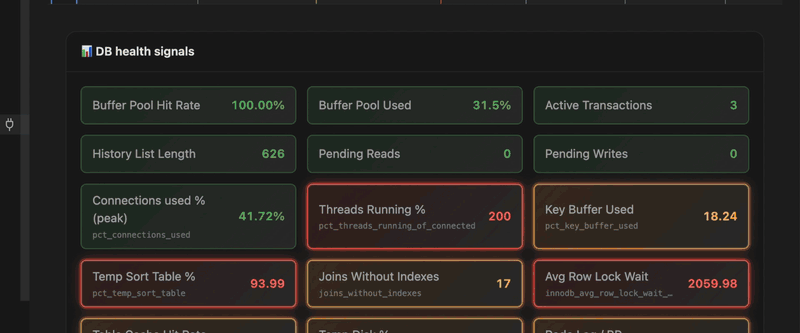

# sqllens.ai

**Write SQL faster. Boost MySQL performance with AI.**  
Advanced MySQL GUI for **VS Code** and **Cursor** — query builder, optimizer, profiler, performance monitor, and AI-assisted SQL.

[](https://marketplace.visualstudio.com/items?itemName=skylineai.sqllens)

> Public showcase: product demos, animated captures, and build metadata (same order as [sqllens.ai](https://sqllens.ai/)).  
> Extension **source code** is not published here.

## Quick links

| Resource | Link |
|----------|------|
| Product website | [sqllens.ai](https://sqllens.ai/) |
| Install extension | [VS Marketplace — SQLLens.AI](https://marketplace.visualstudio.com/items?itemName=skylineai.sqllens) |
| Contact | [hello@skylineai.app](mailto:hello@skylineai.app) |

## What’s in this repo

| Folder | Contents |
|--------|----------|
| [`demos/`](demos/README.md) | Markdown demo scripts |
| [`media/gifs/`](media/gifs/) | UI recordings (same files as sqllens.ai) |
| [`build/`](build/README.md) | Extension metadata (`package.json`, manifest) |
| [`sqllens-demos.code-workspace`](sqllens-demos.code-workspace) | Open demos in VS Code / Cursor |

### Open in VS Code

1. **File → Open Workspace from File…** → `sqllens-demos.code-workspace`  
2. Install recommended **SQLLens.AI** from Marketplace  
3. Preview `demos/*.md` with markdown preview (`Ctrl+Shift+V`)

## Demos — same order as [sqllens.ai](https://sqllens.ai/)

### Main showcases (site hero sections 01–05)

| # | Feature | GIF file |
|---|---------|----------|
| 01 | Visual Query Builder | `query-builder-landing-demo.gif` |
| 02 | AI SQL Copilot | `ai-integration-demo-v4.gif` |
| 03 | Query Optimization Engine | `query-optimizer-workbench-demo.gif` |
| 04 | Slow Query Analyzer & DB Profiler | `query-profiler-demo.gif` |
| 05 | Performance Monitor | `performance-monitor-tour-demo.gif` |

### Full gallery (site section “Every major feature, in motion”)

| # | Feature | GIF file |
|---|---------|----------|
| 1 | Visual Query Builder | `query-builder-landing-demo.gif` |
| 2 | Query Builder — highlights | `query-builder-highlight-demo.gif` |
| 3 | Query Builder — quick start | `query-builder-simple-demo.gif` |
| 4 | SQL workspace | `sql-workspace-overview-demo.gif` |
| 5 | Run & EXPLAIN | `sql-workspace-run-demo.gif` |
| 6 | AI SQL Copilot | `ai-integration-demo.gif` |
| 7 | AI fix & explain | `ai-integration-demo-v4.gif` |
| 8 | Visual Explain | `query-optimizer-visual-explain-demo.gif` |
| 9 | Query Optimizer workbench | `query-optimizer-workbench-demo.gif` |
| 10 | Query Profiler | `query-profiler-demo.gif` |
| 11 | Performance Monitor (open) | `performance-monitor-open-demo.gif` |
| 12 | Performance Monitor tour | `performance-monitor-tour-demo.gif` |









See [demo catalog](demos/README.md) for walkthrough scripts.

## Install (end users)

1. Open **Extensions** in VS Code or Cursor.  
2. Search **SQLLens.AI** (`skylineai.sqllens`).  
3. Install and open the **SQLLens.AI** sidebar.

## License

MIT — see [ATTRIBUTION.md](ATTRIBUTION.md).

## Maintainers

```bash
cd Skylinemysql
node scripts/sync_sqllens_ai_public_repo.js --target ../sqllens.ai
```

Then commit and push `smartmysql/sqllens.ai`.
