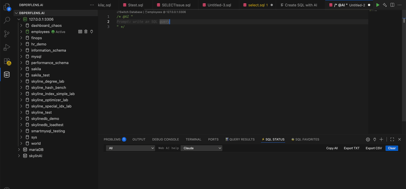

# AI SQL Copilot

Generate, fix, and explain SQL from natural language — with full awareness of the database bound to your editor tab.

  

## Key capabilities

- **Generate** queries from a plain-English description  
- **Fix** broken SQL with context-aware suggestions  
- **Explain** logic for onboarding and code review  
- Works with integrated cloud routing or your own LLM provider configuration  

## Demo walkthrough

1. Open the AI Assist panel with an active MySQL connection.  
2. Ask: *“List employees hired in 1999 with salary above their department average.”*  
3. Review the generated SQL, run it, and show results in the query panel.  
4. Introduce a deliberate error, run **Fix SQL**, and walk through the correction.  

## Additional recording

  

<a href="README.md">← All demo guides</a>

