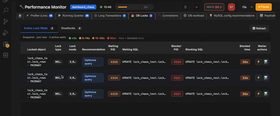

# Performance Monitor

Investigate live database health when performance drops — metrics, processes, and configuration signals in one view.

  

## Key capabilities

- On-demand dashboard (not always-on surveillance overhead)  
- Process list, status variables, and workload indicators  
- Useful alongside **Query Optimizer** when a specific query is suspected  
- Supports replication and lock-contention narratives for DBAs  

## Demo walkthrough

1. Connect to a running MySQL instance.  
2. Open **Performance Monitor** while narrating a “database feels slow” scenario.  
3. Highlight threads, buffer pool usage, and any spike in active connections.  
4. Optionally run a heavy query in another tab and refresh the process list.  

## Opening the monitor

  

<a href="README.md">← All demo guides</a>

