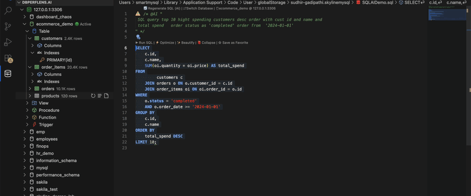
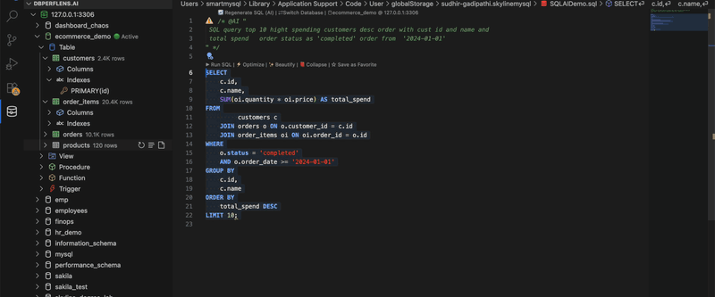

# Query Optimizer (QO) demo

**Product:** Turn the server execution plan into an interactive tree, score steps, and suggest indexes or rewrites.

## When to use QO

- Query is slow on representative data  
- `EXPLAIN` shows `type: ALL` or large row estimates  
- Before shipping a feature with heavy reads  

## Walkthrough script

### 1. Query Optimization Engine (sqllens.ai showcase 03)

1. From a slow query, open the **Query Optimizer** workbench.  
2. Show original SQL, plan tree, and **index suggestions**.  
3. If available, demonstrate **before / after** cost comparison after applying a suggested index (on a dev instance).  
4. Mention **batch optimize** when reviewing multiple statements from Slow Query Log Analyzer.



### 2. Visual Explain (gallery)

1. Open a `.sql` file connected to your demo database.  
2. Place the cursor on a slow `SELECT` (e.g. multi-table join on `employees`).  
3. Use **Optimize** CodeLens above the statement, or **SQL: Visual Explain** from the Command Palette.  
4. Narrate the plan tree: scan type, estimated rows, cost highlights.



## Sample slow query (employees)

```sql
SELECT e.first_name, e.last_name, s.salary
FROM employees e
JOIN salaries s ON s.emp_no = e.emp_no AND s.to_date = '9999-01-01'
WHERE s.salary > (
  SELECT AVG(salary) FROM salaries WHERE to_date = '9999-01-01'
)
ORDER BY s.salary DESC
LIMIT 20;
```

**Beats:** Full table scan story → Visual Explain → index on `(emp_no, to_date)` or covering index discussion.

## Settings to mention (optional)

Users can tune verbosity and Visual Explain behavior under **Settings → SQLLens / Query Optimizer** (`skyline-mysql.queryOptimizer.*` keys in the extension settings UI).

## Tips & limits

- Re-run `EXPLAIN` after creating indexes to confirm the planner uses them.  
- Suggestions are statistics-based — validate on production-like volume.  

## Related demos

- [Query Builder](query-builder.md) — build the query first  
- [Performance Monitor](performance-monitor.md) — correlate with live server load  
- [Demo catalog](README.md)
