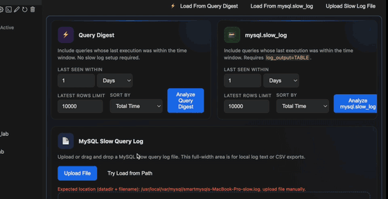
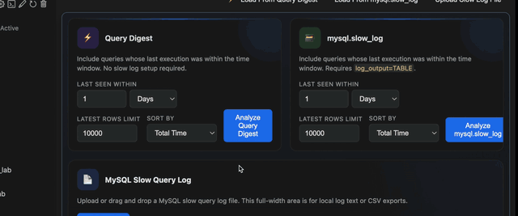

# SQL workspace demo

**Product:** Database explorer, SQL editor, per-file database context, CodeLens, and Query Results — the daily workspace inside VS Code or Cursor.

## Connect {#connect}

1. Install **SQLLens.AI** from the [VS Marketplace](https://marketplace.visualstudio.com/items?itemName=skylineai.sqllens).  
2. Open the **SQLLens.AI** activity bar.  
3. **Add connection** — host, port, user, password; optional default database, SSL, SSH tunnel.  
4. **Test connection** before save.  
5. Expand the tree: server → database → tables.  

## Walkthrough script

### 1. Workspace overview

1. Show sidebar tree + SQL editor + Query Results panel layout.  
2. Open `employees` (or your demo schema).  
3. Create a new `.sql` file; note **per-file @ DB** or active database badge when switching schemas.

### 2. Run and EXPLAIN

1. Paste or build a `SELECT` with CodeLens **Run** / **Explain**.  
2. Show result grid, export, and error handling.  
3. Transition to [Query Optimizer](query-optimizer.md) for the same statement.

## Favorites & productivity (optional)

- Save frequent queries to favorites from the editor.  
- Mention keyboard shortcuts doc in full product documentation on [skylineai.app](https://skylineai.app).  

## Day-one checklist

| Step | Done |
|------|------|
| Extension installed | ☐ |
| Connection tested | ☐ |
| Tree expanded for demo DB | ☐ |
| `.sql` file bound to correct database | ☐ |
| One query executed successfully | ☐ |

## Related demos

- [Query Builder](query-builder.md)  
- [AI integration](ai-integration.md)  
- [Demo catalog](README.md)
